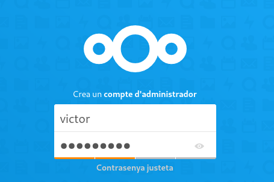
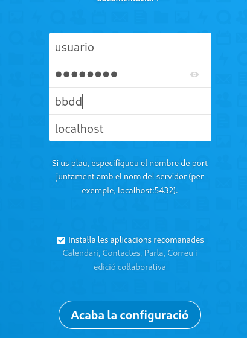
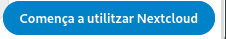
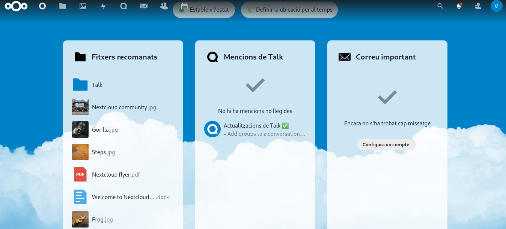
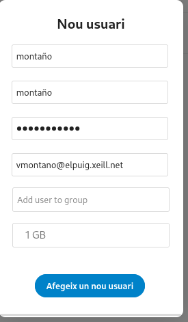
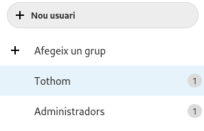
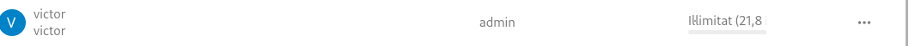

# configuración del nextcloud

1. primero al ya tener el nextcloud crearemos la cuenta.

 ]
2. aqui podremos ver la pantalla inicial del nextcloud.

3. le daremos a la opción que nos aparece en la siguiente foto.

4. a continuación nos saldra la siguiente patalla que nos enseña las distntas opciones que podemos hacer.

5. en esta captura podremos ver las opciones en concreto que podemos hacer

6. creamos una cuenta como administrados en el nextcloud y llenarlo con tu usuario contraseña etc...

7. lo añadiremos al grupo que corresponda

8. como podemos ver ya tenemos nuestra cuenta creada en el netxcloud

