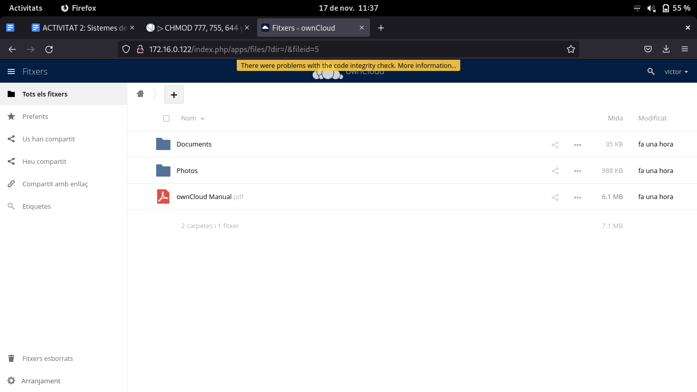

# configuración owncloud

1. iniciamos sesión en owncloud

2. a continuación nos saldra la siguiente pantalla

3. le daremos clic a nuestro nombre arriba a a derecha y nos saldra un recuadro como este y le daremos a la opción de usuaris y vrearemos uno.

4. como podemos ver este es el usuario que tenemos creado en owncloud

5. y este es en el grupo que pertenece

6. para subir un fichero vamos a la parte izquierda de la ppantalla y veremos estas opciones ,le daremos a tots el fitxers

7. a continuación para subir uno le daremos a la suma y añadiremos uno  con la opción de puja y nos dara para elegir un fichero

